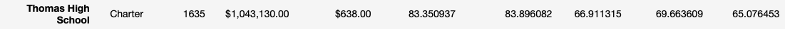

# School_District_Analysis

## <u>Overview - School District Analysis:</u> 
    The main analysis focused preparing and overview of the key district metrics for the school board.  Some of the metrics included, average math and reading scores in each grade. After performing the initial analysis, it was informed that a specific high school showed evidence of academic dishonesty regarding reading and math grades. Therefore, the school board asked for some data to be removed and to re-run the analysis again.

## <u>Results</u>: 

-   How is the district summary affected?
    The average for math and reading scores as well as the overall passing scores, decresed slightly since values for reading and math were dropped. 

    *Original District Summary*
    
    
    *Adjusted District Summary*
    
    

-   How is the school summary affected?

    *Original School Analysis*
    
    

    *Adjusted School Analysis*
    
    

-   How does replacing the ninth graders’ math and reading scores affect Thomas High School’s performance relative to the other schools?

-   How does replacing the ninth-grade scores affect the following:
    -   Math and reading scores by grade
    -   Scores by school spending
    -   Scores by school size
    -   Scores by school type

## <u>Summary</u>: 
*Summarize four changes in the updated school district analysis after reading and math scores for the ninth grade at Thomas High School have been replaced with NaNs.*

## <u>Resources</u>: 
[DataFrame](https://pandas.pydata.org/pandas-docs/stable/reference/api/pandas.DataFrame.set_index.html)

[Python String Formatting](https://thepythonguru.com/python-string-formatting/)

[Markdown](https://www.markdownguide.org/basic-syntax/)