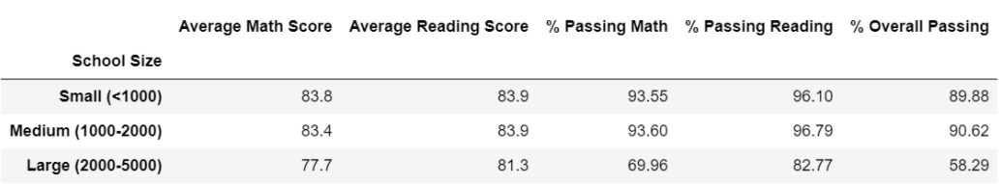

# School_District_Analysis

## <u>Overview - School District Analysis:</u> 

The main analysis focused preparing and overview of   the key district metrics for the school board.  Some of the metrics included, average math and reading scores in each grade. After performing the initial analysis, it was informed that a specific high school showed evidence of academic dishonesty regarding reading and math grades. Therefore, the school board asked for some data to be removed and to re-run the analysis again.

## <u>Results</u>: 

-   How is the district summary affected?
    
    The average for math and reading scores as well as the overall passing scores, decreased slightly since values for reading and math were dropped. 

    *Original District Summary*
    
    
    *Adjusted District Summary*
    
    

-   How is the school summary affected?
    
    The percentage of passing reading and math changed significantly.
    
    *Original School Analysis*
    
    

    *Adjusted School Analysis*
    
    

-   How does replacing the ninth graders’ math and reading scores affect Thomas High School’s performance relative to the other schools?

    *Thomas High School at the top five schools with 90.9% passing rate*
    

    *Thomas High School with 65% overall passing rate*
    

-   How does replacing the ninth-grade scores affect the following:
    -   Math and reading scores by grade:
        
        For the ninth-grade scores, Thomas High School, had **83.7** reading average and **83.6** math average in the original analysis. Since the scores replaced with null values, now the tables show as NaN for Thomas High School.

        *Adjusted reading scores*

        

        *Adjusted math scores*

        

    -   Scores by school spending:

        *Original spending summary*
        

        *Adjusted spending summary*
        

    -   Scores by school size:

        There was a slight change in the **Medium** classification. The formatting was changed to the hundredths decimal place in order to see a difference in the results.  

        *Original scores by School size*
        

        *Adjusted scores by School size*
        

    -   Scores by school type:

        The scores had a slightly smaller value for the school type results. 

        *Original scores by School type*
        

        *Adjusted scores by School type*
        

## <u>Summary</u>: 
*Summarize four changes in the updated school district analysis after reading and math scores for the ninth grade at Thomas High School have been replaced with NaNs.*

-   The overall passing percentage for Thomas High School dropped from 91% to 65%. 
    
-   This caused the ranking to drop from second place in the district.

-  Adjusted data for Thomas High School shows **'NaN'** at the grade level.

-   The average for math and reading scores decreased  slightly after removing ninth-grade values.

## <u>Resources</u>: 
[DataFrame](https://pandas.pydata.org/pandas-docs/stable/reference/api/pandas.DataFrame.set_index.html)

[Python String Formatting](https://thepythonguru.com/python-string-formatting/)

[Markdown](https://www.markdownguide.org/basic-syntax/)